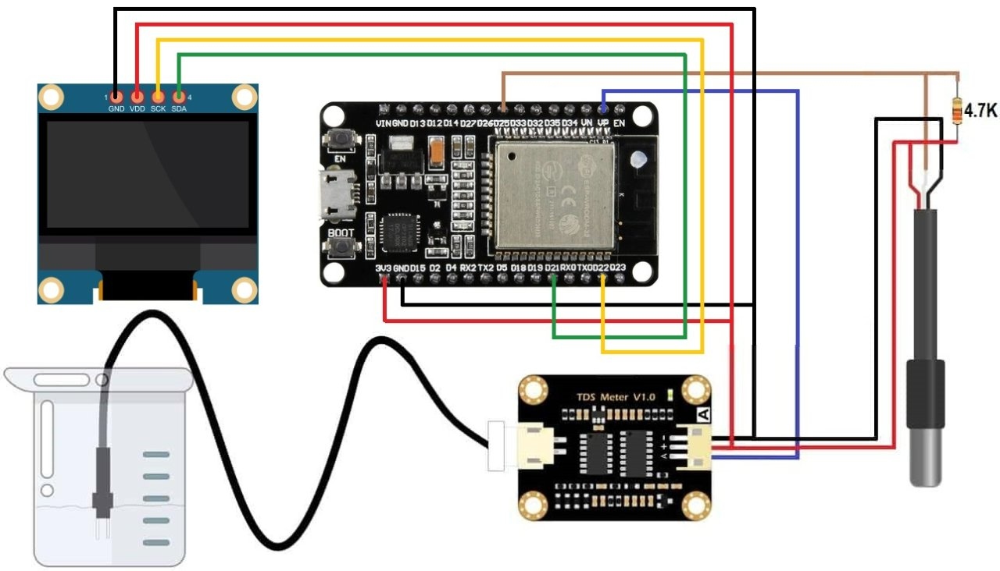
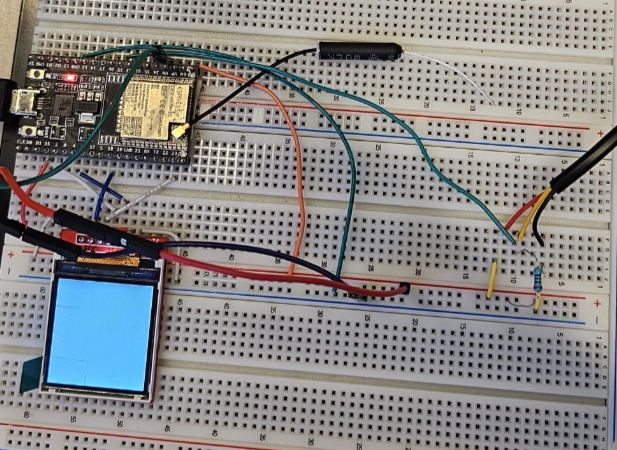
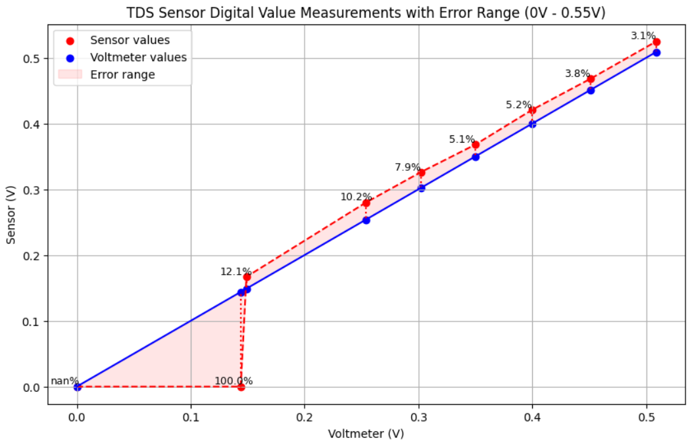
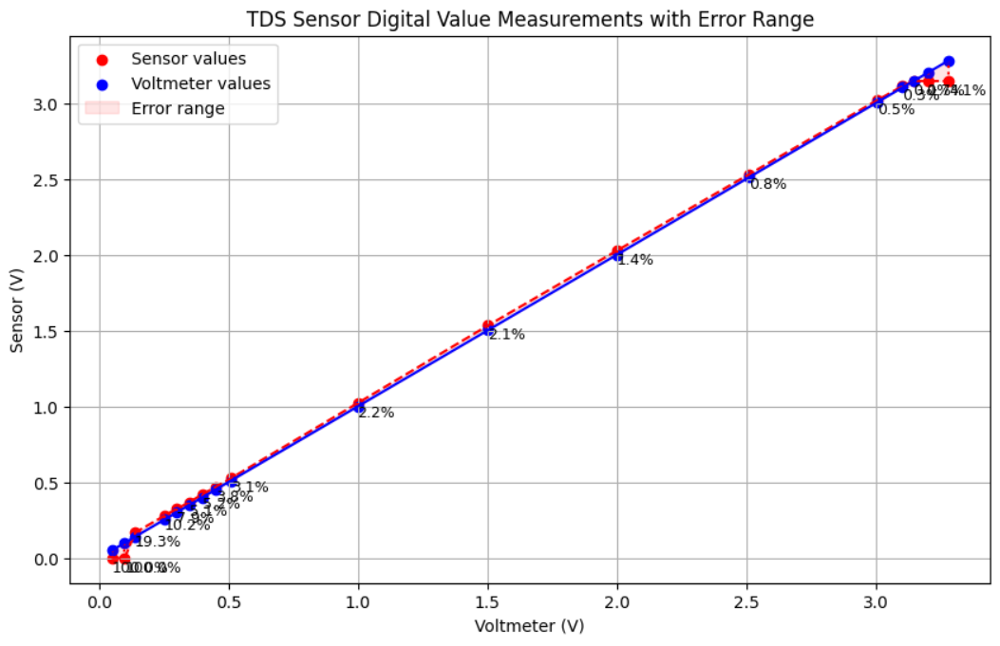
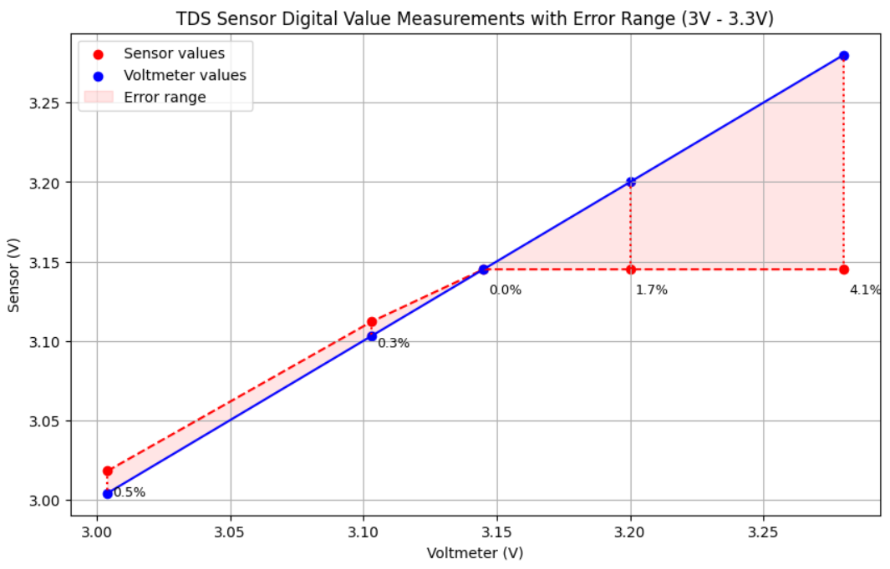
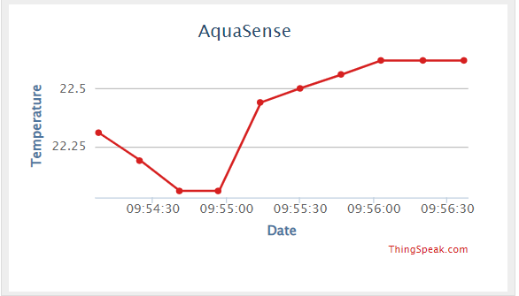
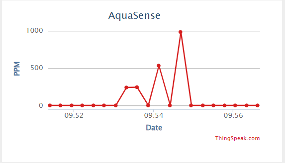
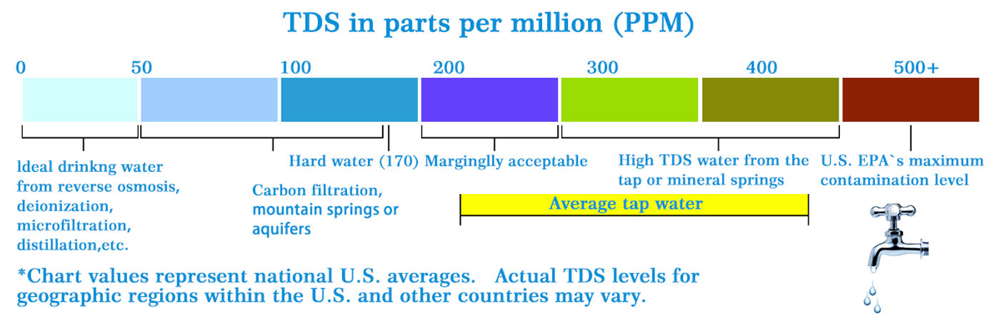
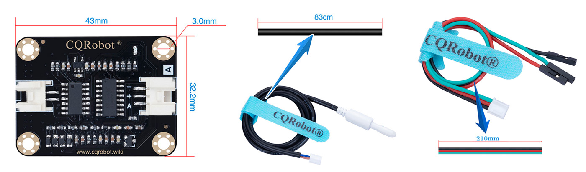
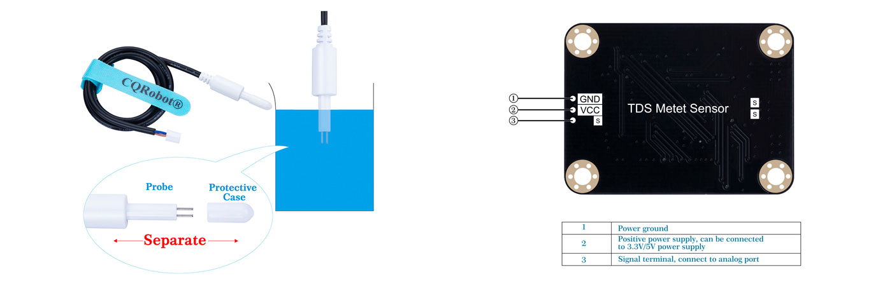

# 💧 AquaSense – IoT Water Quality Monitoring System

## 📌 Overview

**AquaSense** is a low-cost, DIY IoT system for real-time monitoring of **drinking water quality**, focusing on two key parameters:

- **Electrical Conductivity (EC)**: indicator of water purity and potential pipe corrosion
- **Temperature**: important for user preference and calibration

The system uses the **ESP32 DevKit v4**, a **TDS/EC sensor**, and a **DS18B20 temperature sensor**. Readings are displayed locally on an **OLED screen** and transmitted to an **IoT cloud server (ThingSpeak)** for remote visualization and logging.

---

## 🎯 Objectives

- Create a **dependable and cost-effective** solution to verify the potability of tap water.
- Implement a **WiFi-connected monitoring system** with local display and remote logging.
- Provide a scalable prototype for future upgrades (e.g., pH, turbidity, ML-based predictive maintenance).

---

## ⚙️ System Architecture

### Hardware Components

| Component | Description |
|----------|-------------|
| **ESP32 DevKit v4** | Main MCU with WiFi/Bluetooth |
| **TDS/EC Sensor (CQRSENTDS01)** | Measures total dissolved solids (TDS) |
| **DS18B20** | Digital temperature sensor |
| **OLED Display (SSD1306 or 1.44" SPI MSP1443)** | Displays live readings |
| **Breadboard + Wires + 4.7kΩ resistors** | Prototyping setup |

### Software Components

- Arduino IDE or PlatformIO (ESP-IDF)
- ThingSpeak Cloud (via REST API)
- Custom calibration for ADC voltage conversion

---

## 🛠️ Implementation Plan

### Sensor Integration
- Connect and test EC and temperature sensors
- Calibrate ADC readings for TDS values

### WiFi & IoT Integration
- Connect ESP32 to WiFi
- Send periodic data to ThingSpeak

### Display Integration
- Initialize SPI/I2C OLED
- Show updated EC and Temp readings in real time

---

## 📈 Results

| Voltage | TDS (ppm) | Error (%) |
|---------|-----------|-----------|
| 0.4 V   | ~155 ppm  | ~5%       |
| 3.1 V   | ~2107 ppm | ~0.3%     |

> 📌 **WHO drinking water standard**: EC < 400 μS/cm (roughly < 200 ppm)

Graphs show acceptable sensor accuracy across the usable range, suitable for consumer-grade water monitoring.

---

## 🧪 Formula Summary

**1. Temperature Compensation**  
Compensate raw readings based on water temperature

**2. ADC Calibration**  
Map ESP32 ADC readings to real voltage range (e.g., 0.4 – 3.14 V)

**3. TDS Conversion Equation**  
Apply corrected formula to estimate ppm from voltage

---

## 🌐 ThingSpeak Dashboard:
Real-time data can be accessed via the public ThingSpeak channel:

[https://thingspeak.com](https://thingspeak.com)

---

## 🔧 Bill of Materials (BoM)

| Item | Qty |
|------|-----|
| ESP32 DevKit v4 | 1 |
| TDS/EC Sensor (CQRSENTDS01) | 1 |
| DS18B20 Temperature Sensor | 1 |
| OLED Display (SSD1306 or MSP1443) | 1 |
| 4.7kΩ Resistor | 5 |
| Breadboard | 1 |
| Jumper Wires | 10 |

---

## 📚 References

- [ESP32 ADC Calibration Guide](https://docs.espressif.com/projects/esp-idf/en/v4.4.4/esp32s3/api-reference/peripherals/adc.html)
- [ThingSpeak IoT Platform](https://thingspeak.com/)
- [DS18B20 Sensor Tutorial](https://randomnerdtutorials.com/esp32-ds18b20-temperature-arduino-ide/)
- [1.44" SPI OLED Module (MSP1443)](http://www.lcdwiki.com/1.44inch_SPI_Module_ST7735S_SKU:MSP1443)

---

## 📌 Future Improvements

- Add pH and turbidity sensors
- Implement ML model to detect abnormal readings and suggest pipe maintenance
- Add buzzer alerts or push notifications
- Integrate with smart home assistants (e.g., Home Assistant, Alexa)

---

## 📸 Visual Overview

### 🧠 System Architecture
  
> Complete overview of the AquaSense system using ESP32, EC and temperature sensors, OLED display, and cloud-based monitoring with ThingSpeak.

---

### 🔧 Physical Setup
  
> Final working prototype on breadboard with ESP32, TDS sensor, DS18B20 temperature sensor, and OLED display.

---

### 📟 ESP32 Pin Mapping
  
> Pin configuration used to connect the sensors and display to the ESP32 board.

---

## 📊 Sensor Accuracy & Limitations

### ⚡ Sensor Error at Low Voltage Range (0–0.55 V)
  
> At low voltage levels, the sensor shows non-linear and less accurate readings — useful for detecting very pure water, but with a larger error margin.

---

### 📉 General Accuracy Trend Across Full Range
  
> Graph showing overall accuracy and voltage-to-ppm mapping across the full TDS range, after ADC compensation.

---

### ✅ Sensor Stability at High Voltage Range (3.0–3.3 V)
  
> In the optimal detection range (above 2.5V), the sensor behaves linearly and precisely — best suited for detecting contaminated or mineral-rich water.

---

## ☁️ Remote Monitoring via ThingSpeak

### 📡 Cloud-Based Visualization
  
> Real-time data sent from ESP32 to ThingSpeak every 2 seconds, including EC and temperature values.

  
> Detailed chart visualization of sensor data over time — allows remote diagnostics and alerting.

---

## 🧪 Sensor Details

### 🚱 WHO-Based Toxicity Scale
  
> Reference chart to classify water quality based on TDS (ppm) thresholds — ranging from ideal to unsafe.

---

### ⚙️ Internal Sensor Components
  
> The EC/TDS sensor module includes a waterproof probe and a signal conditioning board (0–2.3V analog output).

---

### 🌊 Probe Immersion During Calibration
  
> Waterproof TDS sensor immersed during calibration and testing phase with the ESP32 ADC.

---

---

## 👤 Author

**Gianluca Giuseppe Maria De Nardi**  
Double MSc in Artificial Intelligence & Embedded Systems  
University of Udine & Alpen-Adria-Universität Klagenfurt  
[LinkedIn](https://www.linkedin.com/in/gianluca-de-nardi/)

---

## 📜 License

This project is licensed under the [MIT License](LICENSE).

